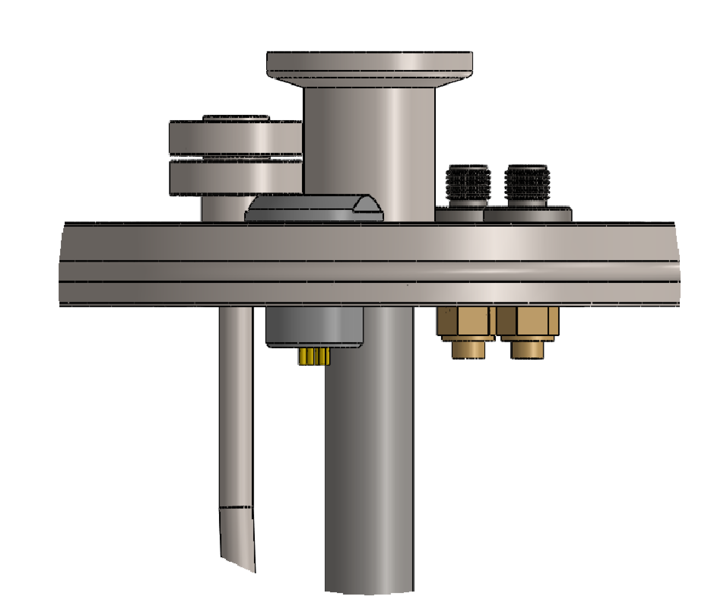
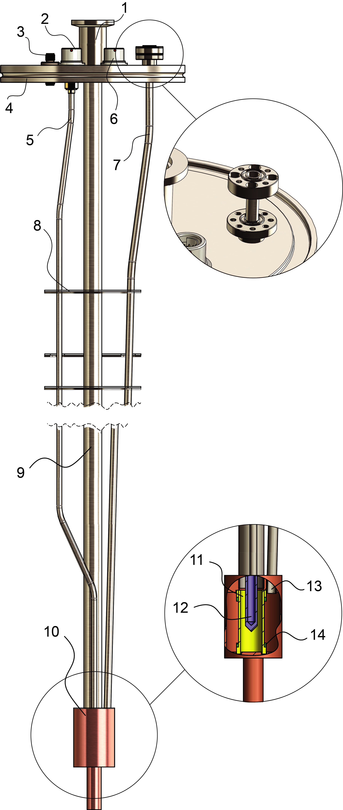
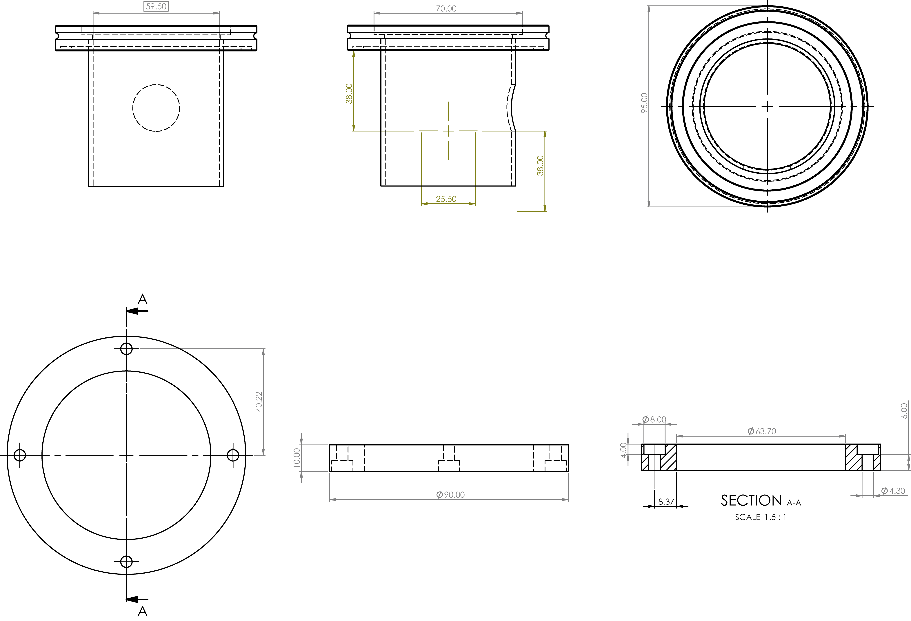
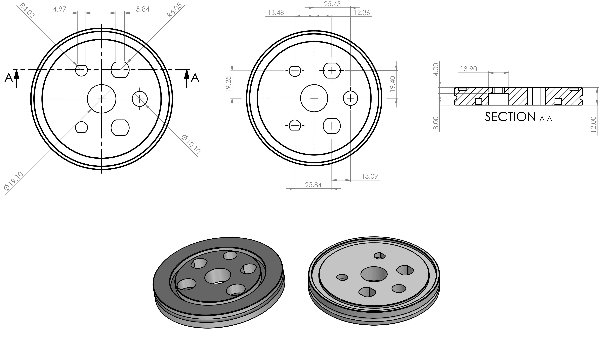
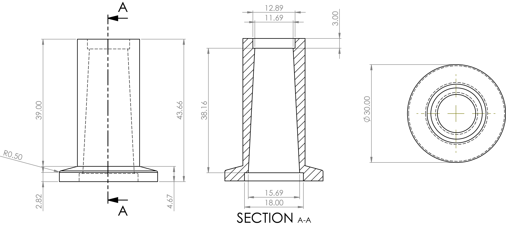
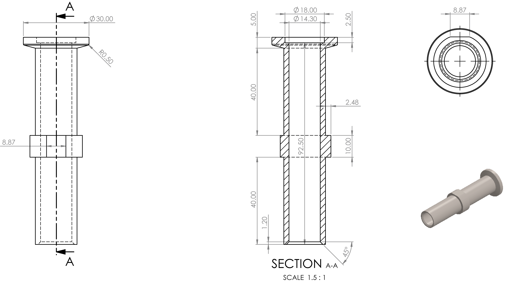
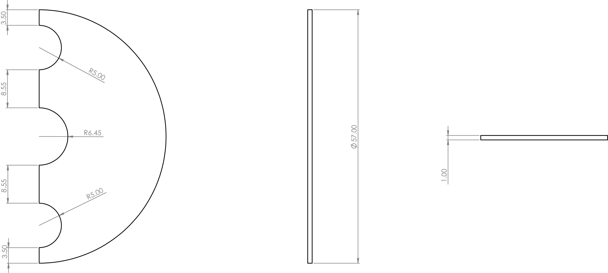
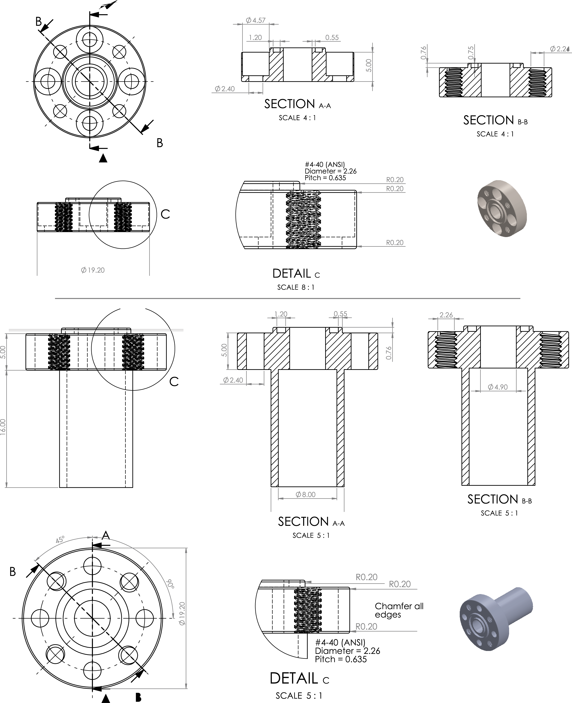
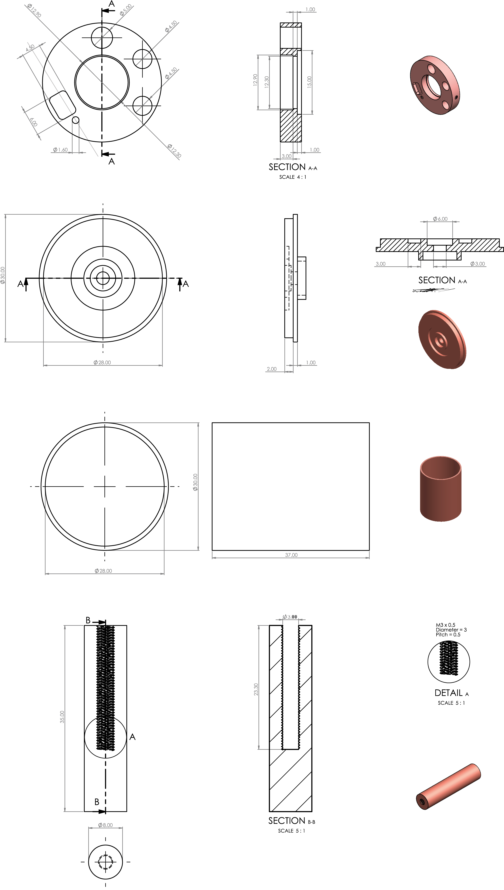

<!-- PROJECT LOGO -->
 

  
 

<h3 align="center">A single sample dissolution DNP insert</h3>

<!-- ABOUT THE PROJECT -->
## **About the project**
The dDNP insert is responsible for centering the sample in the homogeneous region of the magnet and provide sample access to microwave irradiation, RF circuitry and dissolution. The insert is designed to minimize manufacturing complexity, cost and static heat loads when in the magnet’s cryostat. More detials can be found in the following article:

[Albannay, M. M., Vinther, J. M. O., Petersen, J. R., Zhurbenko, V. & Ardenkjaer-Larsen, J. H. Compact, low-cost NMR spectrometer and probe for dissolution DNP. J. Magn. Reson. 304, 7–15 (2019)](https://www.sciencedirect.com/science/article/abs/pii/S1090780719300825)

### Designed with
* Solidworks 2019
***

<!-- TABLE OF CONTENTS -->

  
<h2 style="display: inline-block">Table of Contents</h2>

  <ol>
    <li>
      <a href="#about">About</a>
    </li>
    <li>
    <a href="#design-and-construction">Design and construction</a>
    <ul>
        <li><a href="#cryostat-flange">Cryostat flange</a></li>
        <li><a href="#top-flange">Top flange</a></li>
        <li><a href="#sample-port">Sample port</a></li>
        <li><a href="#sample-tube">Sample tube</a></li>
        <li><a href="#purging-chamber">Purging Chamber</a></li>
        <li><a href="#baffles">Baffles</a></li>
        <li><a href="#waveguide">Waveguide</a></li>
        <li><a href="#modified-ug387-flange-and-mate">Modified UG387 flange and mate</a></li>
        <li><a href="#microwave-cavity">Microwave cavity</a></li>
    </ul>
    </li>
  </ol>

***

## Design and construction

  

*dDNP insert illustration. 1.sample loading port, 2. & 6. thermometry and helium level sensing connector, 3. hepatic SMA connector, 4. ISO-63 flange, 5. UT141SS-C-P coaxial cable, 7. waveguide, 8. baffles, 9. sample tube, 10. overmoded cavity, 11. PTFE coil former, 12. sample vial, 13. waveguide outlet, 14. Sample coil (green). Not illustrated: second hepatic SMA connector (positioned behind component 2.). Inset illustrates modified UG387 waveguide flange and coupling flange*

(<a href="#top">back to top</a>)

***

### Cryostat flange

The insert fits in an Oxford Instruments STD Spectrostat 86/62 cryostat. A cryostat flange receives the insert facilitates a pumping outlet (KF-40). The bottom plate presses on an O-ring atop the cryostat and is screwed with 4 M5 screws. The cryostat flange is a two piece assembly constructed from 304L stainless steel and is vacuum welded together.

  

(<a href="#top">back to top</a>)

***

### Top flange
304L stainless-steel ISO-63 flange, mates with the top of the cryostat using a centering ring equipped with an O-ring and three/four claw clamps. The flange houses multiple connectors; two hermetic bulkhead female-to-female SMA connectors (SF2991-6002,SV microwaves, FL, USA) to access the RF circuitry and two hermetic low voltage connectors (Fischer, St-Prex, Switzerland OR LEMO, Écublens, Switzerland) for helium level sensing and thermometry. Varnished 32 AWG Phosphor bronze wires are used to connect the two low voltage connectors with the sensors placed on the insert cavity. The wire thickness and material offer low thermal conductivity and high electrical resistivity. Brazed on the ISO-63 is a modified UG387 flange with four additional threaded M2 holes and an O-ring to receive a waveguide at a later stage. O-rings are lightly coated with cryogenic grease (Apiezon N, M & I Materials Ltd, Manchester, UK) to improve their seal under vacuum.

  

(<a href="#top">back to top</a>)

***

### Sample port

The sample port was machined as whole from 304L stainless steel, slotted into the top flange (ISO-63) and vacuum-tight welded from top and below. A gate valve (01224-KA24VAT, VAT, Switzerland) and airlock adapted install above the KF16 flange.

  

(<a href="#top">back to top</a>)

***

### Sample tube

Sample tube: 304L stainless-steel tube (Wellington Tube Supplies Ltd, Hayes, UK)
(ID = 11.8±0.2 mm, OD = 12.7±0.2mm and h = 790±1 mm) is slotted through the top flange and into the sample port. A weld joint between the sample port and the sample tube wall secures the assembly. 

(<a href="#top">back to top</a>)

***

### Purging chamber

The purging chamber receives a sample tethered via a fluid path/PEEK tube with a dynamic O-ring seal from the top and mates to a gate valve at the bottom (KF-16 flange). Prior to introducing the sample into the cryostat the atmosphere surrounding the vial is to be flushed with helium to mitigate blockage in the cryostat capillary. Not illustrate is the purging inlet, which is simply a threaded hole that matches the appropriate Legris/SMC gas quick connector.

  

(<a href="#top">back to top</a>)

***

### Baffles 

316L stainless steel sheets are cut to produce 4 semi-circle baffles (r =
57 mm and t = 1±0.2 mm) and welded to the sample tube. The baffles mitigate black-body radiation a towards the sample from the room temperature top flange and improve thermoacoustic stability. There are 3 semi-circle cuts in the baffles to accommodate the sample tube, waveguide and coaxial cable(s). The middle two baffles are spaced 22 mm apart, while 110 mm separate the top and bottom baffles. The top baffle is positioned 145 mm from the top flange

  

(<a href="#top">back to top</a>)

***

### Waveguide 

316L seamless stainless-steel tube (Wellington Tube Supplies Ltd, Hayes,
UK) (ID = 4.16±0.2 mm, OD = 4.80±0.2 mm and h = 780±1 mm) is welded to a modified UG387 flange hosting an O-ring.

(<a href="#top">back to top</a>)

***

### Modified UG387 flange and mate

The purpose of the modified UG387 flange is to allow coupling between the waveguide and microwave source. The UG387 mate found on the ISO-63 flange is to designed to accommodate the waveguide into the insert while ensuring vacuum tight mechanical coupling. Both parts are machined from 304 L stainless steel.

  

(<a href="#top">back to top</a>)

***

### Microwave cavity
The cavity is a three-part assembly. The first part is a copper ring constituting
the cavity upper (ID = 27.5±0.2 mm, OD = 12.9±0.2 mm and h = 7±0.2 mm) is welded onto the sample tube. Second, the lower cavity is made from a cylindrical copper can (ID = 28.0±0.2 mm, and h = 30.0±0.2 mm) that tightly fits around the cavity upper and secures to it by two brass M1 screws. Two circular grooves milled in the cavity upper and lower (ID = 13.0±0.2 mm, OD = 15.0±0.2 mm and h = 1.0±0.2 mm) accommodate the coil and coil former. The third part is the cavity tail which is a copper cylinder (OD = 15.0±0.2 mm and h = 20-35 mm) with a threaded hole. The tail is screwed to the cavity lower using a brass M3 screw.

  

(<a href="#top">back to top</a>)

***

<!-- LICENSE -->
## License

Distributed under the MIT License. See `LICENSE.txt` for more information.

<!-- CONTACT -->
## Contact

Mohammed M. Albannay - [@Bannay](https://twitter.com/bannay) - bannay@gmail.com

Project Link: [https://github.com/bannay/ddnp-insert](https://github.com/bannay/ddnp-insert)

***

<!-- ACKNOWLEDGMENTS -->
## Acknowledgments

* [Readme template](https://github.com/othneildrew/Best-README-Template)

(<a href="#top">back to top</a>)

***
